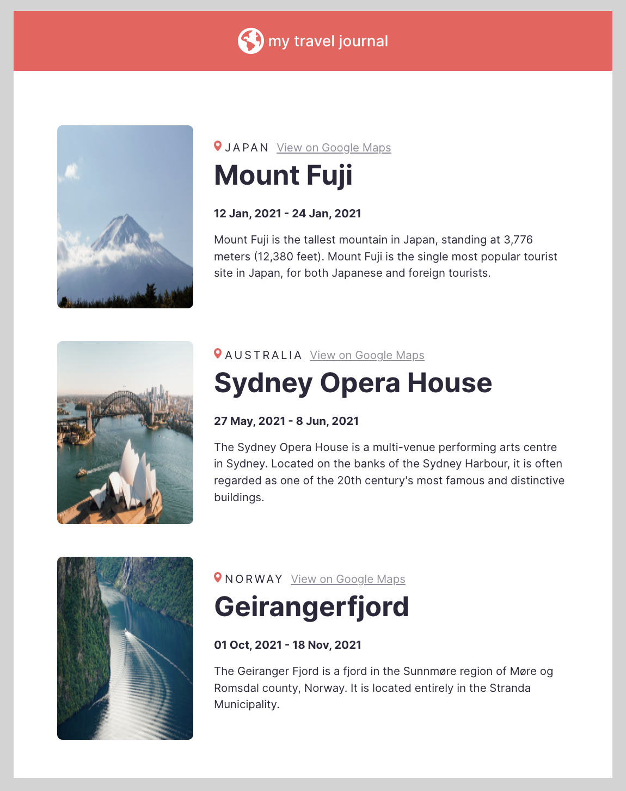

# React Travel Journal

My second React mini-project: a [Scrimba](https://scrimba.com/learn/learnreact) challenge from [this Figma design](https://www.figma.com/file/QG4cOExkdbIbhSfWJhs2gs/Travel-Journal).

This project imports the data from the "data.js" file into App.js (imitating an API call) and uses map() to create an array of React components, passing the data as props into each component.

This project was bootstrapped with [Create React App](https://github.com/facebook/create-react-app).

